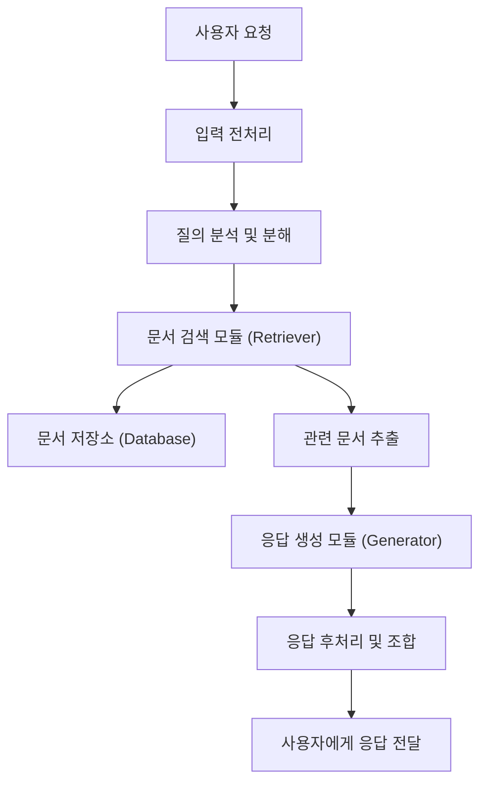
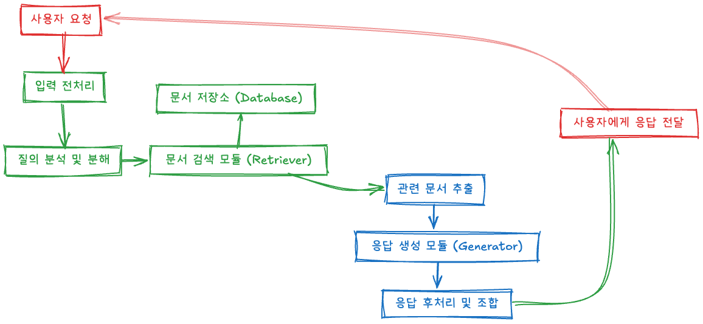

# 프로젝트 계획서

## 1. 목표

### 1.1 제목: ~시스템 개발

### 1.2 목표: 
본 과제는... 을 목표로 함.

## 2. 구성원 및 역할
(개인 프로젝트인 경우 역할 삭제)

- #### 이창준/cjLee-cmd/freestylelike@gmail.com
  - 프로젝트 관리

## 3. 개발 내용
### 3.1 주요 개발 내용

#### A. SW Flow

### B. 기능 정의

#### B.1 전체 기능

#### B.2 세부 기능

## 3. 결과물